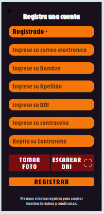
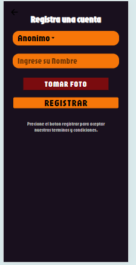
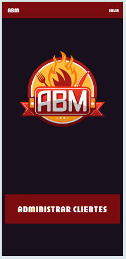
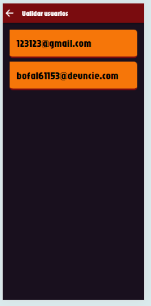
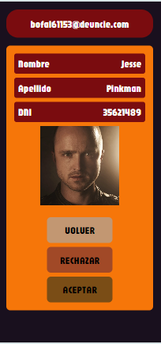
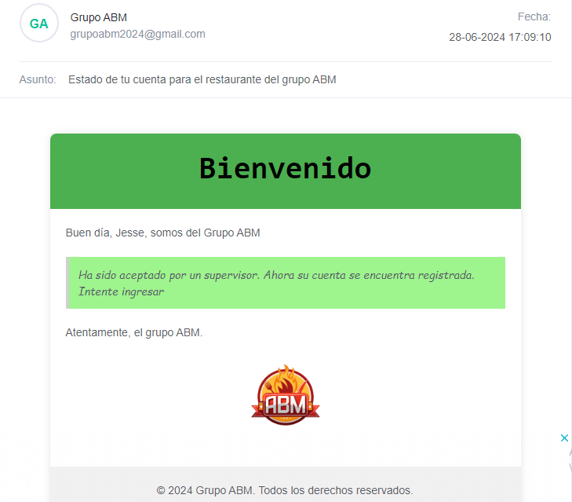
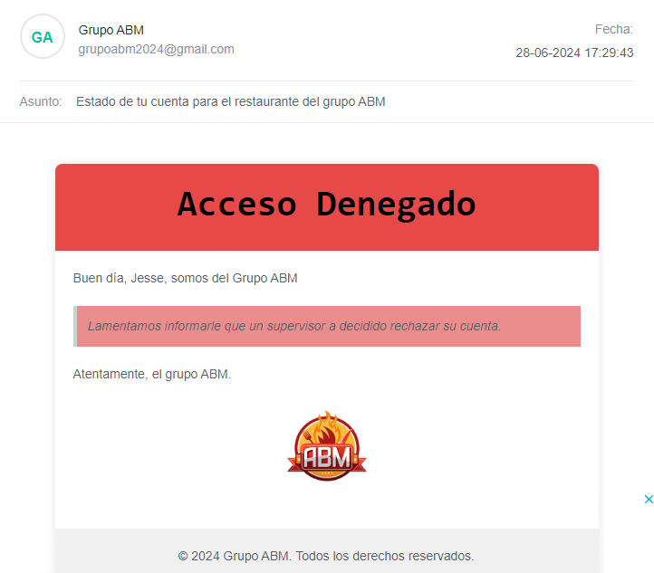
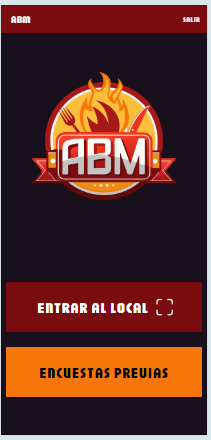
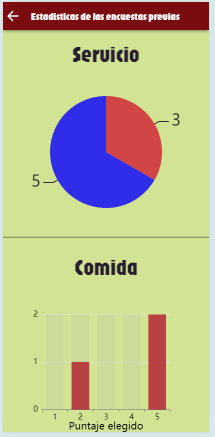
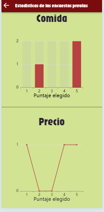

# Práctica Profesional Trabajo Práctico "La Comanda" 2024 Grupo ABM

Este documento cumple la funcion de detallar las **responsabilidades** y **caracteristicas** del trabajo final de la materia _Práctica Profesional_, la cual consiste en una **aplicación movil** encargada de administrar pedidos de un restaurante.

## Integrantes

Somos el grupo ABM

conformado por:

- **Alfa:** Aranda Facundo

  
  

- **Beta:** Barraza Juan Ignacio

  
  

- **Gamma:** Mendoza Benitez Javier Desiderio

  
  

## Ingreso

La pantalla de ingreso pide el correo y la contraseña, además cuenta con un desplegable abajo a la izquierda que cuenta con los usuarios pre registrados, a fin de hacer un ingreso rapido para probar la aplicación. En caso de no tener una cuenta este tiene un enlace para redirigirse al registro

## Registro

La pantalla de registro permite elegir entre registrarse como usuario con clave o usuario anonimo.

### Usuario con clave

El registro normal con clave le pide al usuario que ingrese su mail, nombre, apellido, DNI, imagen y contraseña, junto aun campo para repetir la ultima como confirmacion. Ademas permite la lectura del qr de un dni para hacer la carga de datos mas rapida. Una vez creada redirigira al usuario al login a espera de que un supervisor lo apruebe.

### Usuario anónimo

Por otro lado el usuario anonimo tendra que ingresar nada mas que su nombre y una foto, entrando directamente al sistema sin pasar por el login.

## Pantalla del dueño/supervisor

En esta pantalla el dueño o un supervisor podra tocar un boton para acceder a la lista de usuarios pendientes de aprobacion.

### Administrar clientes

En esta pantalla se mostrara la lista de usuarios pendientes de aprobación, tocando alguno de ellos abrira la pantalla para decidir si el cliente va a ser aceptado o rechazado.

Una vez dentro, el usuario tocara un boton en caso de que quiere aceptar al cliente, rechazarlo, o volver a la lista de usuarios anterior.

Ya sea que el usuario es aceptado o rechazado, este recibira un mail indicando su situacion

## Pantalla cliente

En esta pantalla se le permitirá al cliente escanear el qr para ingresar al local(ponerse en la fila de espera) o poder ver los resultados de las encuestas previas

### Graficos

Se muestran los resultados de las valoraciones que hicieron los clientes anteriores en cuanto al servicio, la comida y el precio

## Módulos

### Enlace de Jira

https://grupoabm.atlassian.net/jira/software/projects/KAN/boards/1?atlOrigin=eyJpIjoiNjY2MGQ3NWY4YWE5NGQwNGIyYmQ5YzZhNGFiMDg1Y2EiLCJwIjoiaiJ9

### Alfa

- **Solucionado splash estatico** _(20/06/24)_
  
  
- **Solucionado credenciales que se quedan al desloguearse** _(20/06/24)_
  
  
- **Agregar un nuevo cliente registrado** _(21/06/24)_
  
  
- **Solucionado correción de estilos de los mails** _(27/06/24)_
  
  
- **Encuesta clientes** _(22/06/2024 - 29/06/24)_
  
  
- **Graficos encuesta clientes** _(22/06/2024 - 29/06/24)_
  
  
- **Push notification: agregar cliente nuevo** _(29/06/2024 - 06/07/24)_
  
  
- **Push notification: pedir la cuenta** _(29/06/2024 - 06/07/24)_

  

- **QR de propina** _(29/06/2024 - 06/07/24)_
  
  

### Beta

- **Diseño de login, splash y logo** _(14/06/24)_
  
  
- **Solucionado primer pantalla de mas** _(21/06/24)_
  
  
- **Solucionado registro anonimo** _(21/06/24)_
  
  
- **QR de ingreso al local** _(21/06/24)_
  
  
- **Ingresar al local** _(21/06/24)_
  
  
- **Solucionado correción de estilos login/register y se agrega el campo repetir contraseña** _(27/06/24)_
  
  
- **Confirmar pedidos** _(22/06/2024 - 29/06/24)_
  
  
- **Push notification: confirmar pedido(por parte del mozo)** _(29/06/2024 - 06/07/24)_
  
  
- **Push notification: confirmar realización del pedido(por parte del cocinero o bartender)** _(29/06/2024 - 06/07/24)_
  
    

### Gamma

- **Alta de clientes** _(16/06/24)_
  
  
- **QR de la mesa** _(21/06/24)_
  
  
- **Asignar mesa** _(21/06/24)_
  
  
- **Solucionado pantalla blanca entre los splash** _(22/06/24)_
  
  
- **Realizar pedidos(platos y bebidas)** _(22/06/2024 - 29/06/24)_
  
  
- **Push notification: ingresar al local** _(29/06/2024 - 06/07/24)_
  
  
- **Push notification: consultar al mozo** _(29/06/2024 - 06/07/24)_

  
