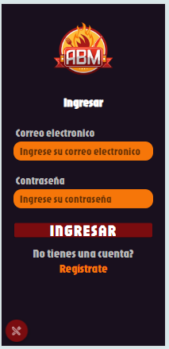

# Práctica Profesional Trabajo Práctico "La Comanda" 2024 Grupo ABM

Este documento cumple la funcion de detallar las **responsabilidades** y **caracteristicas** del trabajo final de la materia _Práctica Profesional_, la cual consiste en una **aplicación movil** encargada de administrar pedidos de un restaurante. 

## Integrantes
Somos el grupo ABM 

 

conformado por:

- **Alfa:** Aranda Facundo

  

- **Beta:** Barraza Juan Ignacio

  

- **Gamma:** Mendoza Benitez Javier Desiderio

  

## Bienvenida e Ingreso

La pantalla de bienvenida muestra la opción de ingresar y de registrarse, este último es para que un cliente se registre de forma completa o de forma anónima

La pantalla de ingreso pide el correo y la contraseña, además cuenta con un desplegable abajo a la izquierda que cuenta con los usuarios pre registrados, a fin de hacer un ingreso rapido para probar la aplicación

## Módulos
### Alfa
- **Alta de dueño/supervisor** _(15/06/2024 - 22/06/24)_
    
    
- **Alta de productos** _(15/06/2024 - 22/06/24)_   
    
    
- **QR de ingreso al local** _(15/06/2024 - 22/06/24)_   
    
    
- **Encuesta clientes** _(22/06/2024 - 29/06/24)_   
    
      
- **Agregar un nuevo cliente registrado** _(22/06/2024 - 29/06/24)_   
    
        
- **Generar reservas agendadas** _(22/06/2024 - 29/06/24)_   
    
      
- **Push notification: agregar cliente nuevo** _(29/06/2024 - 06/06/24)_   
    
        
- **Push notification: generar reservas agendadas** _(29/06/2024 - 06/06/24)_   
    
        
- **Juego: 10% de descuento** _(29/06/2024 - 06/06/24)_   
    
       
### Beta
- **Alta de empleados** _(15/06/2024 - 22/06/24)_
    
    
- **QR de la mesa** _(15/06/2024 - 22/06/24)_   
    
    
- **Encuesta empleados** _(22/06/2024 - 29/06/24)_   
    
         
- **Ingresar al local** _(22/06/2024 - 29/06/24)_   
    
        
- **Push notification: ingresar al local** _(29/06/2024 - 06/06/24)_   
    
          
- **Push notification: consultar al mozo** _(29/06/2024 - 06/06/24)_

      
- **Realizar pedido con GPS o dirección** _(29/06/2024 - 06/06/24)_

        
- **Mapa de ruta hasta el domicilio de entrega** _(29/06/2024 - 06/06/24)_        
    
        
- **Juego: 15% de descuento** _(29/06/2024 - 06/06/24)_   
    
        
### Gamma
- **Alta de clientes** _(15/06/2024 - 22/06/24)_
    
    
- **Alta de mesa** _(15/06/2024 - 22/06/24)_   
    
    
- **QR de propina** _(15/06/2024 - 22/06/24)_   
    
    
- **Encuesta supervisor** _(22/06/2024 - 29/06/24)_   
    
         
- **Realizar pedidos(platos y bebidas)** _(22/06/2024 - 29/06/24)_   
    
         
- **Confirmar pedidos** _(22/06/2024 - 29/06/24)_   
    
        
- **Push notification: confirmar pedido(por parte del mozo)** _(29/06/2024 - 06/06/24)_   
    
          
- **Push notification: confirmar realización del pedido(por parte del cocinero o bartender)** _(29/06/2024 - 06/06/24)_   
    
        
- **Juego: 20% de descuento** _(29/06/2024 - 06/06/24)_   
    
        

